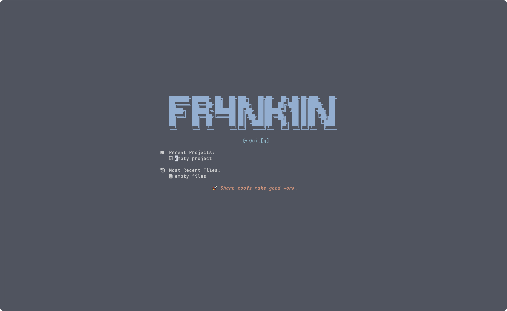

# Fr4nk1inCs' Nixvim

Personalized [neovim](https://neovim.io/) configured with [NixVim](https://nix-community.github.io/nixvim/).



There are 3 versions of the configuration:

- "`minimal`": A configuration that doesn't include desktop/GUI-only features, but it's still bulky :(
- `full`: The full configuration with all the features. This is what I daily use.
- `fullWsl`: The full configuration with all the features, but with some tweaks for WSL.

## Try it out or install it

To test the config without first cloning the repo simply run the following command:

```console
$ nix run github:Fr4nk1inCs/nixvim
```

Add to flake:

1. Add this repo to your flake inputs:

   ```nix
   inputs.nixvim.url = "github:Fr4nk1inCs/nixvim";
   ```

2. Use the `nixvim` package in your `environment.systemPackages`:

   ```nix
   {inputs, ...}:
   {
     environment.systemPackages = [
       inputs.nixvim.packages.${system}.default
     ];
   }
   ```

   Or in your `home.packages`:

   ```nix
    {inputs, ...}:
    {
      home.packages = [
        inputs.nixvim.packages.${system}.default
      ];
    }
   ```

   Or as a `nixpkgs.overlays`:

   ```nix
   import nixpkgs {
     overlays = [
       (final: _: {
         nixvim = inputs.nixvim.packages.${system}.default;
       })
     ];
   }
   ```

If you want to use it on any other Linux distribution, I have some GitHub Actions that uses [ralismark/nix-appimage](https://github.com/ralismark/nix-appimage) to bundle the configurations (with all dependencies) into an AppImage. However, the AppImage is so big (1.1G for minimal) that I wouldn't upload it to the release page (due to storage limits). You can fork this repo, manually trigger the GitHub Actions yourself, take a cup of coffee, download the output artifact and unzip it to get the executable. (Build once, run anywhere! :>)

Currently, AppImage is only available for both `minimal` and `full` configurations on x86-64 Linux.
